<!--
  INTENTIONAL ACCESSIBILITY ISSUES (workshop exercises, do not fix without checking):
  E1: Missing alt text (Scenario 1)
  E2: File name as alt text (Scenario 2)
  E3: AI-generated alt text (Scenario 3)
  E10: Low contrast text (Color Contrast section); Empty table headers (Tables section)
  E11: Color as sole means (bar chart example)
  E12: Missing language of parts (Spanish passage)
  E13: Flashing content (seizure risk illustration)
  These seeded errors are used during the hands-on workshop for participants to detect and fix.
-->

# Course Content Accessibility

## Overview

The aim of this workshop is not merely basic accessibility training. The aim is **accessibility literacy**: the ability to evaluate what tools catch, recognize what they miss, and make informed decisions about content that no automated check can make for you.

Every document, slide deck, and page published in a course creates an opportunity for access, or a barrier to it. Students who use screen readers, magnification, voice control, or other assistive technologies depend on content that is structured and authored with accessibility in mind.

The Web Content Accessibility Guidelines (WCAG) provide the framework for digital accessibility in higher education. The current legal baseline in the United States is **WCAG 2.1 Level AA**, codified by the DOJ's April 2024 ADA Title II final rule (with compliance deadlines in 2026-2027). **WCAG 2.2**, the latest W3C Recommendation, extends 2.1 with additional success criteria and is the standard practitioners should target. Both versions apply not just to websites but to every file uploaded or created in the LMS: Word documents, PowerPoint presentations, PDFs, and Canvas pages.

Accessibility checkers like **Anthology Ally** (integrated into Canvas LMS), **Microsoft's built-in Accessibility Checker**, and **Adobe Acrobat's Accessibility Check** can help identify issues, but each has significant blind spots. Estimates of what automated tools can catch vary widely by methodology: studies have reported figures ranging from roughly **25% to 57%** of accessibility barriers, with the higher end coming from a 2021 Deque Systems analysis of issues detectable by their axe-core engine.[^1] The rest require human judgment: Is this alt text actually meaningful? Does the heading structure reflect the content's logic? Will a screen reader pronounce this passage correctly?

**Getting to 100% in Ally is the starting line, not the finish.** A perfect Ally score means the content has passed the checks Ally can run. It does not mean the content is free of barriers to access for individuals with disabilities. Automated tools detect the presence of accessibility features (an alt text field that is not empty, a heading tag that exists, a contrast ratio above a threshold) but they cannot evaluate whether those features are meaningful. The remaining barriers, the ones that determine whether a student can actually use the content, require human inspection and manual testing.

This reference covers the accessibility issues most common in course content, organized around eight areas drawn from WCAG success criteria. For each, this reference describes what automated tools detect, what they miss, and what instructional designers and faculty need to verify manually.

| Category | WCAG | Likelihood | Impact |
|----------|------|------------|--------|
| Text Alternatives | 1.1.1 | 5 / 5 | 5 / 5 |
| Color Contrast | 1.4.3 | 4 / 5 | 4 / 5 |
| Color as Sole Means | 1.4.1 | 4 / 5 | 4 / 5 |
| Semantic Structure (Headings & Lists) | 1.3.1, 2.4.1, 2.4.6 | 5 / 5 | 4 / 5 |
| Tables | 1.3.1 | 3 / 5 | 4 / 5 |
| Language | 3.1.1, 3.1.2 | 3 / 5 | 3 / 5 |
| Seizure Risk | 2.3.1 | 1 / 5 | 5 / 5 |

**Likelihood** reflects how frequently the issue appears in typical course content. **Impact** reflects how severely the barrier affects students who rely on assistive technology.

## Impact on Students

Behind every accessibility guideline is a student trying to learn. The technical language of WCAG and the metrics of automated checkers can obscure that reality, so it is worth stating plainly what inaccessible content means in practice.

A student who is blind and uses a screen reader encounters an image with no alt text. The screen reader announces "Graphic. IMG_3847.png." The image might be a chart that the rest of the class is discussing, a diagram central to the week's assignment, or a decorative banner that could have been skipped entirely. The student has no way to know. They must decide whether to ask the instructor, ask a classmate, or move on without the information. None of these are equivalent to simply seeing the image.

A student with low vision enlarges their screen to 200%. A PowerPoint slide with light gray text on a white background, perfectly readable at standard size on the designer's monitor, becomes a wash of near-invisible content. The student can adjust their device settings, but only if they know the problem is contrast and not a rendering error. Multiply this across a semester of weekly slide decks and the cognitive overhead becomes significant.

A student who is deaf or hard of hearing opens a lecture recording with no captions. A student with a motor disability navigates a 40-page PDF with no headings, forced to read through the document line by line because there is no structure to jump to.
These are not edge cases. According to the National Center for Education Statistics, roughly 21% of undergraduate students report having a disability.[^2] Many do not disclose or register with disability services. Accessible content benefits students who never appear in accommodation letters: students learning in a second language, students in noisy environments, students with temporary injuries, students reading on a phone in poor lighting.

The impact column in the table above is a number. The experience behind it is a student deciding whether the course is worth the extra labor, or whether to drop it.

## Shared Responsibility

Accessibility in a course is not the sole responsibility of the instructor or the instructional designer. It is a shared obligation across everyone who creates or contributes content.

### Instructor and instructional designer responsibility

Instructors and instructional designers own the content they author and publish: syllabi, lecture slides, assignments, handouts, Canvas pages, and any files uploaded to the LMS. This is the bulk of course content and where accessibility efforts have the greatest return. Responsibilities include:

- Authoring documents, slides, and pages with accessibility built in from the start, not remediated after the fact
- Running automated checks (Ally, Microsoft Accessibility Checker, Acrobat) before publishing
- Performing manual review for issues automated tools cannot catch
- Providing equivalent alternatives when content cannot be made fully accessible (e.g., a transcript for audio, a data table for a complex chart)
- Responding to student-reported barriers promptly

### Student responsibility

Students are also content creators. In discussion boards, peer review assignments, group wikis, student-led presentations, and uploaded submissions, students author content that other students must access. When a student posts an image in a discussion without alt text, their peers who use screen readers are excluded from the conversation.

Student responsibility for accessibility should be:

- **Taught, not assumed.** Most students have never encountered alt text, heading structure, or document language settings. Accessibility expectations need to be introduced explicitly, ideally with brief guidance and examples early in the course.
- **Scoped to the tools at hand.** Students can reasonably be expected to add alt text to images they post, use heading styles instead of bold text for structure, and choose readable color combinations. They should not be expected to remediate PDFs in Acrobat Pro or write ARIA attributes.
- **Modeled by the course itself.** Students are more likely to adopt accessible practices when the course content they receive is itself accessible. An instructor who adds alt text to every image normalizes the practice. An instructor whose slides lack headings implicitly signals that structure does not matter.
- **Reinforced through feedback.** When accessibility is part of assignment criteria, even lightly (such as "include alt text for any images in your post"), it becomes part of the learning culture rather than an afterthought.

Accessibility is not a compliance task delegated to one role. It is a baseline expectation for participation in a shared learning environment.

## Two Types of Accessibility Issues

Clearing every issue in Anthology Ally is a great place to start for access and inclusion in the classroom. Unfortunately, it is nowhere near the full scope of accessible course materials. Ally performs automated tests that lack context and are not yet refined enough to catch major issues where human review is required.

**Automated testing failures** are issues that tools like Ally can detect programmatically: a missing alt text attribute, text contrast below 4.5:1, an improperly nested heading tag, a table with no designated headers, a faked list (dashes or numbers typed manually instead of list markup). These are structural, binary checks. The attribute exists or it doesn't. The ratio passes or it doesn't. Automated tools are reliable and efficient at catching these issues, and they should always be the first step.

**Manual testing discoveries** are issues that require human evaluation: alt text that exists but is meaningless, a heading structure that is technically present but logically incoherent, a color-coded rubric with no non-color indicator. No automated tool can assess whether content is *meaningful*, *clear*, or *instructionally sound*. It can only determine whether certain technical markers are present. These issues will pass every automated check and still create barriers for students. It is possible, for example, to create course content that is massively inaccessible but still passes all automated checks. Consider a document where every paragraph is styled as Heading 2, every image has alt text that reads "image," a layout table forces content into a two-column format, and an untranslated Spanish paragraph sits inside an English document with no language attribute. That document would score 100% in Ally.

This reference uses that framework throughout. For each accessibility category, it describes what automated tools detect (the first type) and what requires manual review (the second type). Both are necessary. Neither is sufficient alone.

## Automated Testing

Automated accessibility testing tools scan content against a set of programmatic rules. They are fast, consistent, and essential, but they are also limited to what can be evaluated without human interpretation.

**Anthology Ally** runs checks on files uploaded to Canvas and on Canvas page content. It produces an accessibility score and flags issues with severity levels (Minor, Major, Severe). Ally is effective at catching:

- Missing alt text on images
- Insufficient color contrast ratios on text
- Skipping heading levels
- Tables without designated header rows
- Faked lists (content that looks like a list but uses manual bullets, dashes, or numbers instead of proper list styles)

Beyond detection, Ally provides two additional features that support accessibility workflows:

- **Remediation guidance.** When Ally flags an issue, it provides specific instructions for fixing it: how to add alt text in Word, how to designate a header row in a table, how to set the document language. This guidance is practical and file-type-specific, making Ally a useful teaching tool for instructors learning to author accessible content.
- **Alternative format generation.** Ally automatically generates accessible alternative formats for uploaded files, including HTML, ePub, electronic braille, audio (MP3), and tagged PDF. These alternatives give students options when the original file is not fully accessible. However, alternative formats are a fallback, not a substitute for accessible source content. The quality and reliability of the Tagged PDF alternative format is source-format dependent, not just source-quality dependent. Word documents generally convert to tagged PDF with acceptable fidelity because the document model maps cleanly. PowerPoint sources produce unreliable tagged PDF output even when the source file is fully accessible and passes Microsoft’s Accessibility Checker. Direct testing confirmed that the conversion can introduce inaccessible content not present in the source, including raw SVG path data exposed as text and empty Figure tags with no alt text. PDF-to-tagged-PDF conversion provides no value because no richer source data exists to work from. None of the alternative formats will fix semantic errors like meaningless alt text or incorrect language metadata. Accessibility must be built into the source material first, and instructors should understand that alternative formats are not a reliable accessibility fallback for all source types.

### Alternative format reliability by source format

The following table summarizes the reliability of Ally’s Tagged PDF alternative format based on the source file type. These findings were confirmed through direct testing of fully accessible source files.

| Source Format | Tagged PDF Reliability | Notes |
|---|---|---|
| Word (.docx) | Acceptable | Document model transfers cleanly to tagged PDF structure |
| PowerPoint (.pptx) | Poor | Multiple conversion failures confirmed even from fully accessible sources; see known failures below |
| PDF | No value | No richer source data to work from; the conversion cannot infer structure that is not already present |

> **Framing note.** Anthology’s documentation states that the accessibility of alternative formats depends on the state of the original file. The findings below are beyond the scope of what that caveat addresses. The source file used for testing was fully accessible and passed Microsoft’s Accessibility Checker. The failures documented here are conversion fidelity problems: the conversion pipeline itself failed and introduced barriers not present in the source.

**Empirically tested: PowerPoint to Tagged PDF conversion failures**

- **Heading structure.** Slide title placeholders were not converted to leveled headings consistently. Some slides produced <H> tags, others produced <H2>, with no discernible logic governing level assignment. An inconsistent heading hierarchy is worse for screen reader navigation than no headings at all.
- **List and table structure.** Structured lists and tables in the source were flattened to bare 
 tags in the output. No semantic relationships between items were preserved.
- **SVG path data exposure (most severe).** Charts and graphs were not rendered, described, or skipped. The conversion extracted raw SVG path strings and exposed them as text content inside Figure tags (e.g., “PathPathPathPathPathPathPathPathPath”). A screen reader will attempt to announce this string. The conversion introduced content not present in the source.
- **Empty Figure tags.** Some images produced Figure tags with no content and no alt text. Screen readers announce “figure” and then nothing.
- **Document language.** Not assigned in the output despite being set in the source file.

##### What transferred correctly

Alt text on images carried over to the tagged PDF output.

To describe Ally's behavior across file types, this reference uses a coverage model with four states:

- **Checked:** Ally runs the check and reports results
- **Gap:** The accessibility issue can exist in this file type, but Ally does not check for it
- **Unreliable:** The check exists but produces inconsistent results
- **N/A:** The check does not apply to this file type

The most important limitation of any automated tool is that it checks for **presence**, not **quality**. Ally will pass an image whose alt text is "asdf" because alt text exists. It will pass a document whose every paragraph is tagged as Heading 1 because headings exist. **[TODO: Verify this claim by testing a document with all paragraphs set to Heading 1 in Ally.]** Reaching a 100% Ally score means the content has passed the checks Ally can run. It does not mean the content is free of barriers to access for individuals with disabilities.

## Manual Testing

Manual testing fills the gaps that automated tools cannot reach. At minimum, an accessibility review of course content should include:

- **Reading alt text in context.** Does each description convey the same information a sighted student would get from the image? Is decorative content marked as decorative rather than described?
- **Navigating by headings.** Using a screen reader's heading list (or the Navigation Pane in Word), can a student understand the document's structure and jump to the section they need?
- **Checking reading order.** In PowerPoint and PDF, content may appear visually correct but be read in the wrong sequence by a screen reader. The reading order pane (PowerPoint) and tags panel (Acrobat) reveal the actual order.
- **Verifying table structure.** For complex tables with merged cells or multiple header rows, a screen reader test confirms whether row and column headers are announced correctly.
- **Listening to language.** If a document contains passages in a language other than the primary language, a screen reader test reveals whether pronunciation switches correctly.
- **Reviewing color use.** If color is used to indicate status, category, or meaning (e.g., red for incorrect, green for correct), verify that a non-color indicator is also present.

Screen reader testing does not require expertise. Even a brief listen with VoiceOver (macOS), NVDA (Windows), or JAWS confirms whether content is navigable and comprehensible.

### Instructional quality as accessibility

Manual review also extends to a dimension that no automated tool addresses: whether the content is instructionally clear enough to be usable by all students. A technically accessible document, one with alt text, headings, contrast, and language set correctly, can still be inaccessible in practice if it is poorly organized, ambiguously written, or assumes visual context that is never stated in text. Accessibility and instructional clarity are not separate concerns. A confusing document is harder to navigate for everyone and disproportionately harder for students using assistive technology, who cannot skim, scan, or rely on visual layout cues to compensate for unclear writing.

## Microsoft Accessibility Checker

Microsoft Word, PowerPoint, and Excel include a built-in Accessibility Checker (Review > Check Accessibility). It runs locally before content is uploaded to the LMS and catches several issues that Ally does not:

- **AI-generated alt text.** When Microsoft auto-generates a description, its own checker flags it for review. Ally does not.
- **File name as alt text.** Both the Microsoft checker and Ally flag this, but Microsoft also catches cases where the description is clearly a file path.
- **Missing slide titles.** Both tools flag this.
- **Table header rows.** Both tools flag this.

The Microsoft checker does **not** flag:

- Language issues (missing or incorrect document language)
- Alt text quality (vague, placeholder, or gibberish descriptions pass)
- Color contrast in document content
- Reading order problems
- Faked lists (manually typed bullets, dashes, or numbers instead of list styles)

##### Best practice

Run the Microsoft Accessibility Checker before uploading to Canvas. It complements Ally by catching AI-generated descriptions and providing fix-in-place workflows within the authoring environment.

## Acrobat Accessibility Checker

Adobe Acrobat Pro includes an Accessibility Check (Accessibility > Accessibility Check) that evaluates PDF tag structure, reading order, and metadata. Here are some of the 29 tests that are run by the checker:

- **Missing alt text.** Flagged and fixable in the tags panel.
- **Document language.** Flags missing language metadata.
- **Tagged PDF structure.** Verifies that the PDF has a tag tree (headings, paragraphs, lists, tables).
- **Tab and reading order.** Checks whether the tag order matches the visual layout.

Acrobat does **not** flag:

- File name used as alt text
- AI-generated alt text
- Alt text quality
- Incorrect language (only missing language)
- Language of parts (e.g., a Spanish paragraph in an English document)

::: {.callout}
**Fix at the source.** Many PDFs created from Word or PowerPoint inherit their accessibility (or lack thereof) from the source document. Fixing issues at the source is almost always more efficient than remediating in Acrobat after export.
:::

## Text Alternatives

> In this workshop, we will intentionally trigger each of the failures described below and fix them live using Microsoft Accessibility Checker, Acrobat Accessibility Check, and Anthology Ally. The goal is not just to clear errors, but to understand why the error exists and what the tool cannot detect.

> **Detection key:** 🔴 Automated failure (tool detects this issue) · 🟡 Manual-only (requires human review) · 🟢 False positive (tool flags incorrectly)

**[WCAG 1.1.1 Non-text Content](https://www.w3.org/WAI/WCAG22/Understanding/non-text-content.html) (Level A).** All non-text content must have a text alternative that serves an equivalent purpose.

This is the highest-priority accessibility issue in course content: it is the most common (likelihood 5/5) and has the greatest impact (5/5) on students using assistive technology. Without alt text, a screen reader announces an image as its file name ("Graphic. IMG_3847.png"), providing no information about what the image conveys.

### What automated tools detect

| Scenario | Ally | MS Office | Acrobat |
|----------|------|-----------|---------|
| No alt text | Detected | Detected | Detected |
| AI-generated alt text | Not detected | Detected | Not detected |
| File name as alt text | Detected | Detected | Not detected |
| Decorative image not marked | Not detected | Not detected | Not detected |
| Vague alt text ("Quiz comparison chart") | Not detected | Not detected | Not detected |
| Gibberish alt text ("alskjshdsflh") | Not detected | Not detected | Not detected |
| Placeholder alt text ("image") | Not detected | Not detected | Not detected |
| Alt text over ~120 characters | False positive (Canvas) | N/A | N/A |

### What requires manual review

- **Quality and accuracy.** Does the description convey the same information a sighted student would receive? A chart captioned "Quiz comparison chart" passes every automated check but tells a screen reader user nothing about the data.
- **Decorative images.** Divider lines, background textures, and branding elements should be marked as decorative so screen readers skip them. No tool reliably detects images that should be decorative.
- **Complex images.** Charts, graphs, diagrams, and infographics often need extended descriptions beyond what fits in an alt text field. Consider a structured text alternative below the image or a linked long description.
- **SmartArt and grouped shapes.** In Word and PowerPoint, SmartArt graphics and grouped shapes may not be flagged consistently across tools, even when they contain meaningful content.
- **Images of text.** Screenshots of text-heavy content (slides, PDFs, spreadsheets) will pass Ally once alt text is added, but the image itself is the problem. The fix is usually to present the information as real text rather than an image.

### Broken Examples and How to Fix Them

The following scenarios walk through each test case from the detection table above. For each, the "broken" state is described along with the Ally error message (where applicable) and step-by-step instructions for fixing the issue in each platform.

Each scenario includes a set of intentionally broken test files that can be uploaded to Canvas to demonstrate the error (or lack of detection) in Ally, the Microsoft Accessibility Checker, and the Acrobat Accessibility Check.

::: {.summary}
##### In this section

- [Scenario 1: No alt text](#scenario-1-no-alt-text) · 🔴 Ally · 🔴 MS Checker · 🔴 Acrobat
- [Scenario 2: AI-generated alt text](#scenario-2-ai-generated-alt-text) · 🟡 Ally · 🔴 MS Checker · 🟡 Acrobat
- [Scenario 3: File name as alt text](#scenario-3-file-name-as-alt-text) · 🔴 Ally · 🔴 MS Checker · 🟡 Acrobat
- [Scenario 4: Decorative image not marked](#scenario-4-decorative-image-not-marked-as-decorative) · 🟡 Ally · 🟡 MS Checker · 🟡 Acrobat
- [Scenario 5: Vague alt text](#scenario-5-vague-alt-text) · 🟡 Ally · 🟡 MS Checker · 🟡 Acrobat
- [Scenario 6: Gibberish or placeholder alt text](#scenario-6-gibberish-or-placeholder-alt-text) · 🟡 Ally · 🟡 MS Checker · 🟡 Acrobat
- [Scenario 7: Alt text over ~120 characters](#scenario-7-alt-text-over-120-characters-ally-false-positive) · 🟢 Ally (false positive)
- [Complex images](#complex-images)
- [Known False Positive: Alt Text of 120 Characters](#known-false-positive-alt-text-of-120-characters)
:::

---

#### Scenario 1: No alt text (Ally catches)

##### The broken state

An image is inserted into a document, slide, page, or PDF with no alt text at all. This is the most basic and most common text alternative failure.

<!-- Scenario: Missing alt text | Error ID: E1 -->

**No alt text (E1)**

| Broken | Corrected |
|--------|-----------|
| 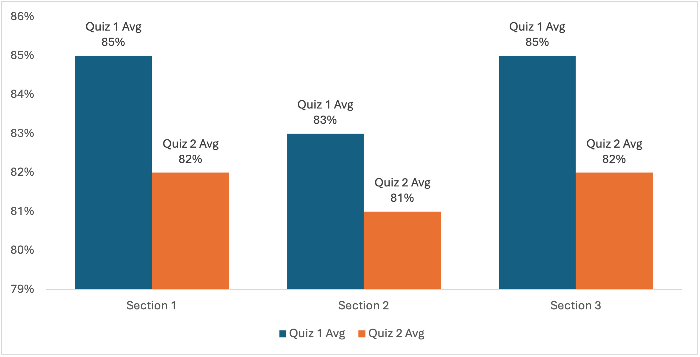 |  |
| **What happens:** Screen reader announces "Graphic" or the file name, no information conveyed. | **What happens:** Screen reader receives the same data as sighted users. |
| *(no alt attribute)* | `alt="Grouped bar chart comparing Quiz 1 and Quiz 2 averages across three sections. Section 1: 85% and 82%. Section 2: 83% and 81%. Section 3: 85% and 82%."` |

<!-- Scenario: File name as alt text | Error ID: E2 -->

**File name as alt text (E2)**

| Broken | Corrected |
|--------|-----------|
| 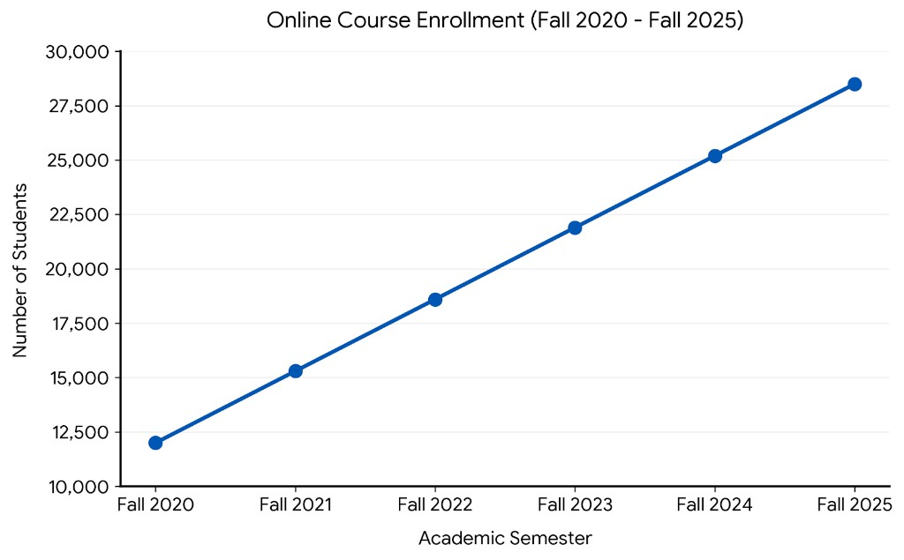 |  |
| **What happens:** Screen reader announces "Graphic. IMG_3847.png", student gets no data. | **What happens:** Screen reader receives the same data as sighted users. |
| `alt="IMG_3847.png"` | `alt="Line graph showing a steady increase in online course enrollment from 12,000 in Fall 2020 to 28,500 in Fall 2025."` |

##### Ally error messages

- **Word:** "Document has images without alt descriptions" (Major)
- **PowerPoint:** "Presentation has images without alt descriptions" (Major)
- **Canvas:** "Images must have alternate text description" (Major)
- **PDF:** "PDF has images without alternative descriptions" (Major)

##### Detected by

🔴 Ally · 🔴 MS Checker · 🔴 Acrobat

##### How to fix in Word

1. Right-click the image.
2. Select **Edit Alt Text**.
3. The Alt Text pane opens on the right side of the screen.
4. Type a description that conveys the same information a sighted reader would get from the image.
5. Close the Alt Text pane.

##### How to fix in PowerPoint

1. Right-click the image.
2. Select **Edit Alt Text**.
3. The Alt Text pane opens on the right side of the screen.
4. Type a description that conveys the same information a sighted reader would get from the image.
5. Close the Alt Text pane.

##### How to fix in Canvas

1. Click the image in the Rich Content Editor.
2. Click the **Image Options** button that appears in the toolbar above the image.
3. In the **Alt Text** field, type a description.
4. Click **Done**.

##### How to fix in PDF (Acrobat Pro)

1. Open the PDF in Acrobat Pro.
2. Go to **All tools > Prepare for accessibility > Check for accessibility**.
3. Click **Start Checking**.
4. In the results, expand **Alternate Text**.
5. Right-click the failed item and select **Fix**.
6. In the **Set Alternate Text** dialog, type a description.
7. Click **Save & Close**.

Alternatively, use the Tags panel directly:

1. Open the **Tags** panel (View > Show/Hide > Navigation Panes > Tags).
2. Locate the **Figure** tag for the image.
3. Right-click and select **Properties**.
4. Enter the description in the **Alternate Text** field.
5. Click **Close**.

*[Screenshot placeholder: Acrobat Set Alternate Text dialog]*

---

#### Scenario 2: AI-generated alt text (Ally does not catch)

**The broken state.** Microsoft Office auto-generates a description when an image is inserted (e.g., "A group of people sitting at a table"). The description may be partially accurate but is often generic, vague, or misleading. It has not been reviewed by a human.

##### Detected by

🟡 Ally · 🔴 MS Checker · 🟡 Acrobat

::: {.callout}
**Tool gap.** Only Microsoft's checker flags its own AI-generated descriptions. Ally and Acrobat see a non-empty alt text field and move on. A 100% Ally score does not mean the alt text has been reviewed by a human.
:::

**AI-generated alt text**

| Broken | Corrected |
|--------|-----------|
| "A group of people sitting at a table" *(AI-generated, unreviewed)*. *AI-generated content may be incorrect.* | "Instructional design team reviewing course accessibility audit results during the Spring 2026 faculty workshop." |
| The description is generic and misses the context of the image within the course. | The description identifies who is pictured, what they are doing, and why it matters in context. |

::: {.callout}
**Key point.** This is a gap in Ally. AI-generated alt text passes Ally because the alt text field is not empty. The Microsoft checker flags it specifically because it can identify its own generated descriptions. Always review and revise AI-generated alt text.
:::

##### How to fix in Word / PowerPoint

1. Run the Accessibility Checker (Review > Check Accessibility).
2. The checker will flag images with AI-generated descriptions under **Verify: Automatic alternative text**.
3. Click the flagged item to select the image.
4. Open the Alt Text pane (right-click > Edit Alt Text).
5. Review the generated description. Revise it to accurately describe the image in context, or replace it entirely.
6. Close the Alt Text pane.

**Not applicable to PDF.** PDFs inherit alt text from the source document or it is added manually in Acrobat. Canvas does have the option to generate alt text in the Dashboard remediation process, but not directly in the Rich Content Editor.

---

#### Scenario 3: File name as alt text (Ally catches)

**The broken state.** The alt text field contains the image's file name (e.g., "IMG_3847.png", "chart_final_v2.jpg", "C:\Users\instructor\Desktop\logo.png"). This typically happens when an image is inserted and the application populates the alt text field with the file name by default.

##### Detected by

🔴 Ally · 🔴 MS Checker · 🟡 Acrobat

**File name as alt text**

| Broken | Corrected |
|--------|-----------|
| "IMG_3847.png" | "Line graph showing a steady increase in online course enrollment from 12,000 in Fall 2020 to 28,500 in Fall 2025." |
| A file name tells the student nothing about the image content. | The description conveys what the image shows and the data it contains. |

##### Ally error messages

- **Word:** "Document has images with their filenames as descriptions" (Minor)
- **Canvas:** "Alt text should not be the image filename" (Minor)

##### How to fix

Follow the same steps as Scenario 1 for each platform. Delete the file name and replace it with a meaningful description of the image.

---

#### Scenario 4: Decorative image not marked as decorative (Ally does not catch)

**The broken state.** A decorative image (a divider line, a background texture, a branding banner, a purely visual flourish) has either no alt text or a description like "decorative line" or "banner image." It should be marked as decorative so screen readers skip it entirely.

##### Detected by

🟡 Ally · 🟡 MS Checker · 🟡 Acrobat. No automated tool can determine whether an image *should* be decorative. This is entirely a human judgment call.

::: {.callout}
**Tool gap.** Deciding whether an image is decorative or meaningful requires understanding the content's purpose. No tool attempts this judgment. Every unmarked decorative image adds noise for screen reader users, and no automated score will reflect it.
:::

**Decorative image not marked as decorative**

| Broken | Corrected |
|--------|-----------|
| "decorative line" or "banner image" | *(marked as decorative):* `alt=""` in HTML, "Mark as decorative" in Office, or artifact in PDF |
| The screen reader announces the decorative image, interrupting the reading flow with meaningless content. | The screen reader skips the image entirely, keeping the student focused on meaningful content. |

##### How to mark as decorative in Word / PowerPoint

1. Right-click the image.
2. Select **Edit Alt Text**.
3. Check the **Mark as decorative** checkbox.
4. Close the Alt Text pane.

##### How to mark as decorative in Canvas

1. Click the image in the Rich Content Editor.
2. Click **Image Options**.
3. Check the **Decorative Image** checkbox. This clears the Alt Text field and sets `alt=""` in the HTML.
4. Click **Done**.

##### How to mark as decorative in PDF (Acrobat Pro)

1. Open the **Tags** panel.
2. Locate the **Figure** tag for the decorative image.
3. Right-click and select **Change Tag to Artifact**. This removes the image from the tag tree so screen readers skip it.

See [Edit document structure with the Content and Tags panels](https://helpx.adobe.com/acrobat/using/editing-document-structure-content-tags.html) on Adobe HelpX for full details.

---

#### Scenario 5: Vague alt text (Ally does not catch)

**The broken state.** The alt text field contains a description that is technically present but too vague to be useful. Examples: "chart," "Quiz comparison chart," "photo," "graph of data." A screen reader user hears the label but receives none of the information the image actually conveys.

##### Detected by

🟡 Ally · 🟡 MS Checker · 🟡 Acrobat. All three tools check for *presence*, not *quality*.

::: {.callout}
**Tool gap.** All automated tools check only for presence. None evaluate informational equivalence. Alt text that reads "chart" passes every check but gives a screen reader user none of the data the chart conveys.
:::

**Vague alt text: Bar chart**

| Broken | Corrected |
|--------|-----------|
| "Quiz comparison chart" | "Grouped bar chart comparing Quiz 1 and Quiz 2 averages across three sections. Section 1: 85% and 82%. Section 2: 83% and 81%. Section 3: 85% and 82%." |
| Names the chart type but provides none of the data. The student knows a chart exists but not what it shows. | Describes the data the chart conveys so the student receives equivalent information. |

**Vague alt text: Photo**

| Broken | Corrected |
|--------|-----------|
| "building" | Mark as decorative (if purely visual) or "Old Queens building on the Rutgers University College Avenue campus. A three-story brownstone building with white-trimmed windows, a central cupola with weather vane, and landscaped grounds in the foreground." (if contextually relevant) |
| A single word provides no useful context about what the photo shows or why it is included. | Either skip the image entirely or describe what is shown and its relevance to the course. |

**Vague alt text: Pie chart**

| Broken | Corrected |
|--------|-----------|
| "pie chart" | "Pie chart of Fall 2025 student survey: 62% satisfied, 24% neutral, 14% dissatisfied." |
| Identifies the chart type but not the data. The student cannot participate in discussion about the results. | Includes the data so the student can engage with the content on equal terms. |

##### How to fix

Follow the same steps as Scenario 1 for each platform. Replace the vague description with one that conveys the same information a sighted reader would get from the image. For charts and graphs, include the data, not just the chart type.

::: {.callout}
**Writing good alt text.** Ask: "If I could not see this image, what would I need to know?" The answer is the alt text. For data visualizations, the alt text should include the data. For photos, it should describe what is shown and why it matters in context. Avoid starting alt text with words like "graphic," "image," or "picture." Screen readers already announce the element as an image, so these labels are redundant and add noise without meaning.
:::

---

#### Scenario 6: Gibberish or placeholder alt text (Ally does not catch)

**Gibberish or placeholder alt text**

| Broken | Corrected |
|--------|-----------|
| "alskjshdsflh" or "asdf" or "image" | A meaningful description of the image, or marked as decorative |
| Gibberish and placeholder text exist only to satisfy the automated check. A screen reader user hears "alskjshdsflh" and gains nothing. | The student receives a description that conveys the image's meaning, or the screen reader skips it entirely if decorative. |

**The broken state.** The alt text field contains nonsense (e.g., "alskjshdsflh," "asdf," "xxx") or a generic placeholder (e.g., "image," "photo," "graphic," "picture"). This typically results from someone filling the field to clear an automated warning without writing a real description.

##### Detected by

🟡 Ally · 🟡 MS Checker · 🟡 Acrobat. The alt text field is not empty, so all tools consider it a pass.

::: {.callout}
**Tool gap.** Typing "asdf" into an alt text field clears every automated warning. The content scores 100%. The screen reader user hears "asdf." This is the clearest illustration of why automated scores alone are insufficient.
:::

##### How to fix

Follow the same steps as Scenario 1 for each platform. Delete the placeholder and write a meaningful description. If the image is decorative, mark it as decorative instead of describing it.

---

#### Scenario 7: Alt text over ~120 characters (Ally false positive)

**Alt text over ~120 characters (false positive)**

| Not actually broken | No need for correction |
|--------------------|-----------|
| "Grouped bar chart comparing Quiz 1 and Quiz 2 averages across three sections. Section 1: 85% and 82%. Section 2: 83% and 81%. Section 3: 85% and 82%." *(flagged as too long)* | no need to change, fine as is |
| Ally flags alt text exceeding ~120 characters in Canvas. | There is no WCAG basis for a character limit. The description is accurate and necessary. Shortening it to clear the flag removes information the student needs. |

**The broken state.** This is not actually broken. The alt text is accurate and meaningful but exceeds approximately 120 characters. Ally flags this in the Canvas Rich Content Editor as an issue. There is no WCAG basis for a character limit on alt text, nor any detriment for screen reader users.

##### Detected by

🟢 Ally (Canvas only, false positive)

##### How to handle

Do not shorten the description to clear the flag. If the description needs to be long to be accurate (common for charts, graphs, and complex images), keep it as written. Note the Ally flag but do not treat it as a real issue. This will not show up in the Accessibility Dashboard in a way that impacts your overall score.

For very long descriptions (multiple paragraphs), consider placing a brief alt text on the image and providing the full description in the body text below the image, or linking to a long description.

---

### Complex images

Charts, graphs, diagrams, infographics, and other complex images often require descriptions that go beyond what fits naturally in an alt text field. For these:

1. Provide a brief alt text on the image that identifies what it is (e.g., "Bar chart of enrollment trends, 2020 to 2025. Full description follows.").
2. Include the full description in the body text immediately below the image, or link to a separate long description.

This ensures the image is not skipped by screen readers and the full information is available in context.

## Known False Positive: Alt Text of 120 Characters

In the Canvas Rich Content Editor, Ally flags alt text exceeding approximately 120 characters. There is no WCAG basis for a character limit on alt text. Do not shorten a description that needs to be long to be accurate.

::: {.callout}
**Key point.** Ally checks that alt text *exists*. It does not check that alt text is *accurate*, *meaningful*, or *appropriate*. Gibberish, placeholder text, and vague labels all pass.
:::

::: {.summary}
**Automated vs. Manual Summary**

- 🔴 **Automated tools catch:** Missing alt text, file name as alt text
- 🟡 **Manual review required:** Alt text quality, decorative image identification, complex image descriptions, SmartArt and grouped shapes
- 🟢 **False positives:** Alt text over ~120 characters (Canvas/Ally only)
:::

::: {.quick-check}
**Quick Check: Text Alternatives**

- Does every meaningful image have alt text that conveys equivalent information?
- Are decorative images marked as decorative (not described)?
- Do charts and graphs have descriptions that include the data, not just the title?
- Has AI-generated alt text been reviewed and revised?
- Are SmartArt graphics and grouped shapes described?
:::

::: {.callout}
##### Now we know that

- **100% in Ally ≠ accessible.** A perfect score means the content passed the checks Ally can run. It does not mean the content is free of barriers. Gibberish alt text, vague labels, and unmarked decorative images all score 100%.
- **Tool layering matters.** No single tool catches everything. Ally misses AI-generated alt text that the Microsoft checker flags. Acrobat misses file-name alt text that Ally catches. Running one tool is a start; running all three closes more gaps.
- **Manual review is non-negotiable.** Scenarios 4, 5, and 6 are invisible to every automated tool. The barriers they create (noise from unmarked decorative images, data withheld by vague descriptions, nonsense read aloud by a screen reader) can only be found by a human reviewing the content.
- **Presence ≠ quality.** Every tool checks whether the alt text field contains something. No tool checks whether that something is accurate, meaningful, or equivalent to the visual content. The difference between those two checks is the difference between compliance theater and actual access.
:::

## Color Contrast

**[WCAG 1.4.3 Contrast (Minimum)](https://www.w3.org/WAI/WCAG22/Understanding/contrast-minimum.html) (Level AA).** Text must have a contrast ratio of at least **4.5:1** against its background. Large text (18pt or 14pt bold) requires at least **3:1**.

Contrast issues are common (likelihood 4/5) and meaningfully affect students with low vision, color vision deficiencies, or those reading on screens in bright environments.

#### Scenario 1: Regular text (Ally catches)

**The broken state.** Regular-weight text uses a color that fails the 4.5:1 minimum against its background. Users with low vision or color deficiencies, or anyone reading in bright light, struggle to read it.

<!-- E10a: Low contrast regular text | Error ID: E10a -->

| Broken | Corrected |
|--------|-----------|
| 
This regular sized text fails the 4.5:1 minimum for normal text.
 | 
This regular sized text passes the 4.5:1 minimum.
 |
| **Contrast ratio:** 3:1 · **Color:** #5692FF · **Required:** 4.5:1 | **Contrast ratio:** 7.3:1 · **Color:** #2d5a7b · **Required:** 4.5:1 |
| `color: #5692FF` (3:1 against white) | `color: #2d5a7b` (7.3:1 against white) |

##### Ally error messages

- **Word:** "Hard-to-read text contrast" (Color and Contrast)
- **PowerPoint:** "Hard-to-read text contrast" (Color and Contrast)
- **Canvas:** "Text should display a minimum contrast ratio of 4.5:1" (Major)
- **PDF:** Contrast issues appear on the Ally Accessibility Dashboard with suggested replacement colors.

##### Detected by

🔴 Ally · 🔴 MS Checker

##### How to fix in Word

1. Select the low-contrast text.
2. Go to **Home > Font Color** (or right-click > Font).
3. Choose a darker color that meets 4.5:1 against the background. Use the [Colour Contrast Analyser (CCA)](https://www.tpgi.com/color-contrast-checker/) to verify.
4. Run the Accessibility Checker (Review > Check Accessibility) to confirm the issue is resolved.

##### How to fix in PowerPoint

1. Select the low-contrast text.
2. Go to **Home > Font Color** and choose a darker color.
3. When the Microsoft checker flags the issue, click a suggested replacement color to fix it in place.

##### How to fix in Canvas

1. Select the low-contrast text in the Rich Content Editor.
2. Run the Accessibility Checker from the editor toolbar.
3. Use the color picker to choose a darker color that meets the minimum, then click **Apply**.

---

#### Scenario 2: Large text (Ally catches)

**The broken state.** Large text (18pt or 14pt bold) uses a color that fails the 3:1 minimum. Even though large text has a lower threshold than regular text, this example still fails.

<!-- E10b: Low contrast large text | Error ID: E10b -->

| Broken | Corrected |
|--------|-----------|
| 
This large text fails the 3:1 minimum.
 | 
This large text passes the 3:1 minimum.
 |
| **Contrast ratio:** 2:1 · **Color:** #91BFE1 · **Required:** 3:1 | **Contrast ratio:** 3.7:1 · **Color:** #4A8CAD · **Required:** 3:1 |
| `color: #91BFE1` (2:1 against white) | `color: #4A8CAD` (3.7:1 against white) |

##### Ally error messages

- **Word/PowerPoint:** "Hard-to-read text contrast" (Color and Contrast)
- **Canvas:** "Text larger than 18pt (or bold 14pt) should display a minimum contrast ratio of 3:1" (Major)

##### Detected by

🔴 Ally · 🔴 MS Checker

##### How to fix

Follow the same steps as Scenario 1 for each platform. Use a darker color that meets the 3:1 minimum for large text.

---

#### Scenario 3: Graphic element (Ally does not catch)

**The broken state.** A chart line, bar fill, or icon uses a color that fails the 3:1 minimum against its background. [WCAG 1.4.11 Non-text Contrast](https://www.w3.org/WAI/WCAG22/Understanding/non-text-contrast.html) (Level AA) requires at least 3:1. No automated tool flags this.

<!-- E10c: Low contrast graphic element | Error ID: E10c -->

| Broken | Corrected |
|--------|-----------|
|  | #F1B4A4 → 1.8:1 (fail) · #C0564B → 4.5:1 (pass) |
| **Contrast ratio:** 1.8:1 · **Color:** #F1B4A4 · **Required:** 3:1 | **Contrast ratio:** 4.5:1 · **Color:** #C0564B · **Required:** 3:1 |
| `Series 1 color: #F1B4A4` (1.8:1 against white) | `Series 1 color: #C0564B` (4.5:1 against white) |

##### Ally error messages

None. Ally does not check graphic element contrast.

##### Detected by

🟡 Not detected by Ally · 🟡 Not detected by MS Checker

##### How to fix

1. Use the [Colour Contrast Analyser (CCA)](https://www.tpgi.com/color-contrast-checker/) to check chart line colors, bar fills, and icons against their backgrounds.
2. Replace any color that fails the 3:1 minimum with a darker or lighter alternative that passes.
3. When creating charts in Excel or PowerPoint, verify data series colors before publishing.

::: {.callout}
**Key point.** Automated tools catch text contrast but miss graphic element contrast entirely. Chart lines, bar fills, icons, and other non-text elements that fail the 3:1 minimum are invisible to both Ally and the Microsoft Accessibility Checker.
:::

The [Colour Contrast Analyser (CCA)](https://www.tpgi.com/color-contrast-checker/) is a free desktop tool that confirms exact contrast ratios and which WCAG criteria pass or fail.

<figure style="max-width: 320px; margin: 1em 0;">
  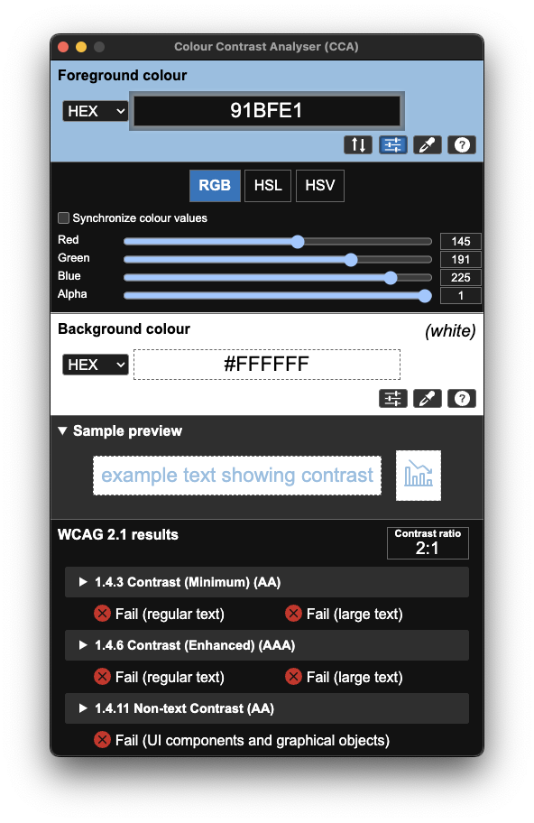
  <figcaption>The Colour Contrast Analyser (CCA) confirms #91BFE1 fails at 2:1.</figcaption>
</figure>

### What automated tools detect

Ally and similar tools measure the contrast ratio between text color and background color and flag combinations that fall below the minimum. This works well for body text in standard layouts.

In Canvas, the Rich Content Editor's built-in Accessibility Checker flags text contrast issues and provides a color picker to fix them in place. Contrast issues also appear on the Ally Accessibility Dashboard, lowering the file's score with suggested replacement colors.

  <figure style="flex: 1; min-width: 200px; margin: 0;">
    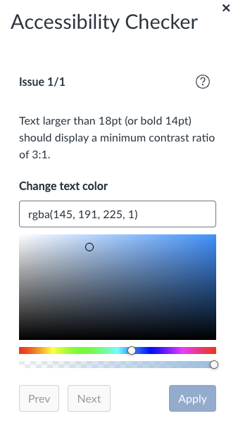
    <figcaption>The Canvas RCE Accessibility Checker flags low-contrast text and offers a color picker to fix it in place.</figcaption>
  </figure>
  <figure style="flex: 1; min-width: 200px; margin: 0;">
    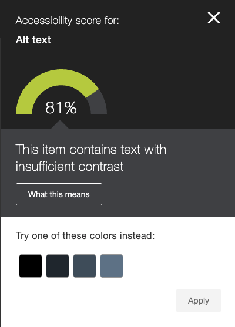
    <figcaption>Ally flags the contrast issue on the Dashboard, lowering the file score to 81% and suggesting darker replacement colors.</figcaption>
  </figure>

### Microsoft Accessibility Checker: contrast detection

The Microsoft Accessibility Checker (Review > Check Accessibility) also detects text contrast issues in Word, PowerPoint, and Excel. When it finds text that is hard to read against its background, the Accessibility Assistant flags it under **Color and Contrast** and offers specific fix suggestions, including alternative font colors and text shading options. This is a useful complement to Ally, particularly for content authored in Office before it reaches Canvas.

  <figure style="flex: 1; min-width: 200px; margin: 0;">
    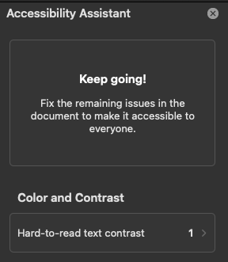
    <figcaption>The Accessibility Assistant flags contrast issues under Color and Contrast.</figcaption>
  </figure>
  <figure style="flex: 1; min-width: 200px; margin: 0;">
    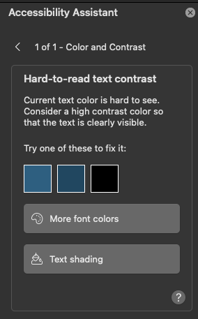
    <figcaption>The detail view offers suggested replacement colors, a font color picker, and text shading.</figcaption>
  </figure>

Unlike Ally, the Microsoft checker provides in-place remediation: clicking a suggested color applies the fix immediately. For contrast issues discovered before upload to the LMS, this is the most efficient fix workflow.

## Known False Positive: Image Contrast in Photographs

Ally claims to evaluate contrast within image files, but this feature is not working as advertised. When a photograph is uploaded (for example, a student's profile photo posted to a discussion board), Ally may flag it with "This image has contrast issues" and a reduced accessibility score. However, Ally cannot make the determinations required for a valid WCAG 1.4.3 test: it cannot distinguish text from non-text graphic content, and it cannot identify the font size or weight needed to determine which threshold applies (4.5:1 for normal text vs. 3:1 for large text). In the example below, a student uploaded a photo to a discussion post. Ally flagged the image at 75% with a contrast warning. The likely trigger is the framed picture hanging on the wall behind the student, which Ally appears to have misidentified as text content.

  <figure style="flex: 1; min-width: 200px; margin: 0;">
    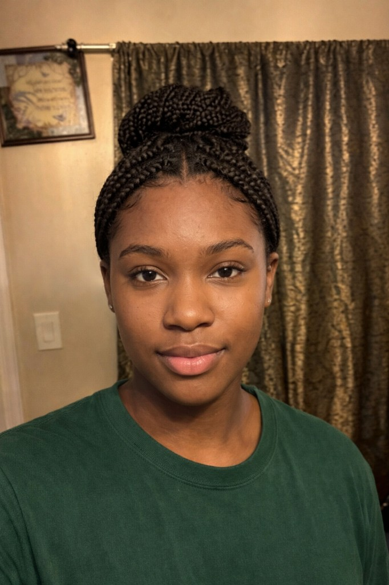
    <figcaption>Student photo uploaded to a Canvas discussion post. Based on a real student photo, heavily manipulated with AI to protect the student's privacy.</figcaption>
  </figure>
  <figure style="flex: 1; min-width: 200px; margin: 0;">
    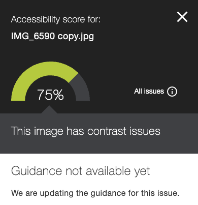
    <figcaption>Ally flags the photo at 75% with "This image has contrast issues." Guidance reads: "Guidance not available yet. We are updating the guidance for this issue."</figcaption>
  </figure>

  Ally's own guidance panel confirms the limitation: it reads "Guidance not available yet. We are updating the guidance for this issue." This suggests the feature is under active development, but in its current state it produces false positives on photographic content. **Do not take action on image contrast warnings in the Accessibility Dashboard.** Until Ally can reliably distinguish text from non-text content within images and determine the applicable WCAG threshold, these flags should be noted but not treated as actionable issues.

::: {.summary}
**Automated vs. Manual Summary**

- **Automated tools catch:** Text-on-background contrast ratios below 4.5:1 (normal text) or 3:1 (large text)
- **Manual review required:** Text embedded in images
:::

::: {.quick-check}
**Quick Check: Color Contrast**

- Does all body text meet a 4.5:1 contrast ratio against its background?
- Does large text (18pt or 14pt bold) meet at least 3:1?
- Have chart labels, axis text, and legend text been checked manually?
- Are branded templates verified, not assumed to pass?
:::

## Color as Sole Means of Communication

**[WCAG 1.4.1 Use of Color](https://www.w3.org/WAI/WCAG22/Understanding/use-of-color.html) (Level A).** Color must not be the only visual means of conveying information, indicating an action, prompting a response, or distinguishing a visual element.

This is a separate requirement from contrast and is **not checked by Ally or any of the standard automated tools**. It requires manual review.

### Scenario: Color as sole means (Ally does not catch)

**The broken state.** Information is conveyed by color alone: a chart uses red vs. green to indicate status, a rubric uses red/yellow/green without text labels, or feedback marks wrong answers in red with no other indicator. A student with a color vision deficiency cannot access the information.

Common examples in course content:

- A rubric that uses red/yellow/green to indicate performance levels without text labels
- A chart where data series are distinguished only by color without patterns or direct labels
- Feedback that marks incorrect answers in red with no other indicator (icon, text, symbol)
- A schedule where color-coded categories have no legend or text equivalent

<!-- Scenario: Color as sole means | Error ID: E11 -->

| Broken | Corrected |
|--------|-----------|
|  |  |
| **What happens:** A student with a color vision deficiency cannot determine which teams are above or below target. Red vs. green is the only indicator. | **What happens:** Every bar includes a score and a text label (Above target / Below target). The full meaning is available regardless of color perception. |
| Color alone distinguishes above-target (green) from below-target (red). No text labels, no patterns, no data values on bars. | Data labels (75, 95, 95, 65) and text labels ("Above target" / "Below target") added to each bar. Meaning is preserved with or without color. |

### Color vision simulation

The following simulations show how the broken and corrected charts appear to users with two common types of color vision deficiency. These are generated using color blindness simulation tools and represent what the chart would look like, not an approximation.

**Deuteranopia** (red-green color blindness) affects roughly 6% of males and is the most common form of color vision deficiency. **Achromatopsia** (total color blindness) is rare but represents the extreme case where all color information is lost.

#### Deuteranopia (red-green color blindness)

| Broken (deuteranopia) | Corrected (deuteranopia) |
|-----------------------|--------------------------|
|  |  |
| Red and green collapse to similar olive tones. A student with deuteranopia sees four bars of nearly the same color and has no way to determine status. | Same color shift, but the text labels make color irrelevant. The student reads "75, Below target" and "95, Above target" directly from the chart. |

#### Achromatopsia (total color blindness)

| Broken (achromatopsia) | Corrected (achromatopsia) |
|------------------------|---------------------------|
|  |  |
| Total color loss. Four gray bars of similar brightness. A student with achromatopsia, or anyone viewing a grayscale printout, receives zero status information from this chart. | Same grayscale view, but the text labels are unaffected by color loss. "75, Below target" and "95, Above target" are as legible in grayscale as in full color. |

### What to look for

Any place where removing color would cause a loss of information. The simulation above demonstrates the test: if the chart were printed in grayscale, would all the meaning still be present? For the broken version, the answer is no. For the corrected version, it is yes.

This applies beyond charts. Look for color-coded rubrics, red/green feedback indicators, schedules where categories are distinguished only by color, and any visual element where a student who cannot perceive color would lose information.

::: {.callout}
**Key point.** No automated tool checks for color as the sole means of communication. This issue is invisible to Ally, the Microsoft checker, and Acrobat. It requires manual review every time.
:::

::: {.summary}
**Automated vs. Manual Summary**

- **Automated tools catch:** Nothing. This is entirely a manual review issue.
- **Manual review required:** Rubrics, charts, feedback, schedules, and any content where color encodes meaning
:::

::: {.quick-check}
**Quick Check: Color as Sole Means**

- If the content were printed in grayscale, would all information still be conveyed?
- Do charts use patterns, labels, or shapes in addition to color?
- Do rubrics and grading scales include text labels alongside color coding?
- Does feedback use icons or text in addition to red/green indicators?
:::

## Semantic Structure

**[WCAG 1.3.1 Info and Relationships](https://www.w3.org/WAI/WCAG22/Understanding/info-and-relationships.html) (Level A), [2.4.1 Bypass Blocks](https://www.w3.org/WAI/WCAG22/Understanding/bypass-blocks.html) (Level A), [2.4.6 Headings and Labels](https://www.w3.org/WAI/WCAG22/Understanding/headings-and-labels.html) (Level AA).** Content structure must be programmatically determinable. Headings must be present and descriptive; lists must use proper list markup.

Headings, titles, lists, and document structure let students navigate and understand content organization. Without them, a 20-page document is a wall of text with no way to jump to a section. Screen reader users rely on headings to jump between sections and on proper list structure to hear "list of X items" and list type. Content that *looks* like a list (typed bullets, dashes, or "1." "2.") but is not marked as a list is invisible to that structure.

### Headings

Heading issues are tied with text alternatives as the most frequently occurring accessibility problem (likelihood 5/5) and have high impact (4/5). For a student navigating a long document or page by screen reader, headings are the primary mechanism for orientation and navigation, equivalent to scanning a page visually.

#### What automated tools detect

- Missing headings entirely (no heading styles used in a Word document, no H tags in a Canvas page)
- Missing slide titles in PowerPoint
- Skipped heading levels (e.g., jumping from H1 to H4), though detection is inconsistent
- Untagged PDFs (no tag structure at all)

#### What requires manual review

- **Heading text quality.** Ally checks that headings exist, not that they are descriptive. "Section 1" or "Untitled" as a heading passes automated checks but provides no useful navigation.
- **Logical hierarchy.** A document where every line is Heading 2 will pass automated checks but provides no meaningful structure.
- **Reading order.** In PowerPoint and PDF, content may be visually organized but read in the wrong sequence. The reading order must be verified in the slide's Selection Pane (PowerPoint) or the Tags panel (Acrobat).
- **Content order in multi-column layouts.** Text boxes, sidebars, and multi-column layouts in Word and PowerPoint may not read in the intended order.

### Lists

**[WCAG 1.3.1 Info and Relationships](https://www.w3.org/WAI/WCAG22/Understanding/info-and-relationships.html) (Level A).** When content is presented as a list, the list structure must be programmatically determinable so that screen readers can announce list type and item count (e.g., "List of 5 items") and allow list-based navigation.

Lists are very common in course content (likelihood 4/5). A **faked list** is content that looks like a list (lines prefixed with a dash, bullet character, or "1." "2." typed by hand) but is not marked up as a list. In Word, that means using the Bullets or Numbering commands (or list styles), not typing characters. In HTML, it means using `<ul>`, `<ol>`, and `<li>` (or equivalent list roles), not plain paragraphs. When a list is faked, a screen reader does not get list structure; it reads a series of paragraphs, and the student loses the benefit of list semantics and navigation.

#### What automated tools detect

- **Ally** flags faked lists: content that visually appears as a list but lacks proper list markup. Ally detects this in Word, PowerPoint, PDF, and Canvas content and reports it as an issue to fix (e.g., "Lists should be formatted as lists," with an option to "Format as a list"). For **Canvas pages and content edited in the Rich Content Editor (RCE)**, the list error often appears in the RCE's Accessibility Checker but may not appear on the Course Dashboard. If you see the issue in the editor, fix it there; do not assume the Dashboard will surface it for the same content.
- **Microsoft Accessibility Checker** and **Adobe Acrobat's Accessibility Check** do not routinely flag faked lists. They may report missing or incorrect list tagging in some contexts (e.g., PDF tag tree), but they do not perform the same "looks like a list but isn't marked as one" check that Ally does. If you rely only on the Microsoft checker or Acrobat, faked lists can pass undetected.

::: {.callout}
**Tool gap.** Ally catches faked lists; the other common checkers generally do not. Content that passes the Microsoft Accessibility Checker or Acrobat can still contain faked lists that create barriers for screen reader users.
:::

::: {.callout}
**Where Ally shows the list error.** For Canvas content, the "Lists should be formatted as lists" issue may show up in the **Rich Content Editor** (when you run the Accessibility Checker from the editor) but not on the **Course Dashboard**. Fix faked lists when the editor flags them; the Dashboard may not list this issue for the same page.
:::

#### What requires manual review

- **Nested and multi-level lists.** Ensure list hierarchy is correct in the source (e.g., list-in-list in Word, nested `<ul>`/`<ol>` in HTML) so reading order and structure make sense.
- **When a "list" is really something else.** A single run of short paragraphs may be clearer as a list; a run of numbered steps must be a real ordered list, not typed "1." "2." in plain text.

::: {.summary}
**Automated vs. Manual Summary**

- **Automated tools catch:** Missing headings, missing slide titles, skipped heading levels (inconsistently), untagged PDFs, faked lists (Ally only; Microsoft checker and Acrobat typically do not flag faked lists)
- **Manual review required:** Heading text quality, logical hierarchy, reading order, content order in multi-column layouts, correct nesting of lists, appropriateness of list vs. paragraph structure
:::

::: {.quick-check}
**Quick Check: Semantic Structure**

- Does the document use heading styles (not just bold or large text) for structure?
- Do headings follow a logical hierarchy without skipping levels?
- Are heading labels descriptive (not "Section 1" or "Untitled")?
- Does every PowerPoint slide have a unique title?
- Has reading order been verified in the Selection Pane (PowerPoint) or Tags panel (PDF)?
- Are bulleted and numbered lists created with the application's list tools (Bullets / Numbering in Word or PowerPoint, list controls in Canvas), not by typing dashes or numbers?
- Would a screen reader user hear list structure (e.g., "List of 4 items") when moving through the content?
- If you only ran the Microsoft checker or Acrobat, have you also checked the content in Ally (or verified list markup) so faked lists are not missed?
:::

## Tables

**[WCAG 1.3.1 Info and Relationships](https://www.w3.org/WAI/WCAG22/Understanding/info-and-relationships.html) (Level A).** Information and relationships conveyed through presentation must be programmatically determinable.

Tables appear less frequently than images or headings (likelihood 3/5) but have high impact (4/5) when they do appear. Without designated header rows, a screen reader reads table cells as raw data with no context. A student hears "85" without knowing which column or row it belongs to.

### What automated tools detect

| Scenario | Ally | MS Office | Acrobat |
|----------|------|-----------|---------|
| No designated header row | Detected | Detected | Detected |
| Table headers with no visible text | Detected | Not detected | Not detected |
| Layout table used for positioning | Not detected | Not detected | Not detected |
| Complex table (merged cells, multiple headers) | Not detected | Not detected | Not detected |

- Tables without a designated header row (Ally, MS Office, Acrobat)
- Tables of 3x3 or larger without headers (Canvas, via axe-core)
- Table headers that exist but contain no visible text (Ally only)

##### Ally error messages

- **Word:** "This document contains tables that are missing headers" (Major)
- **Canvas (HTML):** "This item contains table headers that are missing content" (Major)

Ally distinguishes two separate table header issues. The first is a table with no designated header row at all. The second is a table where header cells exist but are empty, meaning the `<th>` elements contain no visible text describing the purpose of the row or column. Both reduce the document's accessibility score.

  <figure style="flex: 1; min-width: 200px; margin: 0;">
    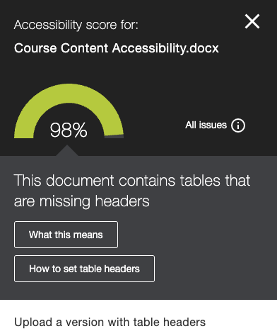
    <figcaption>Ally flags the document at 98% for tables without designated headers.</figcaption>
  </figure>
  <figure style="flex: 1; min-width: 200px; margin: 0;">
    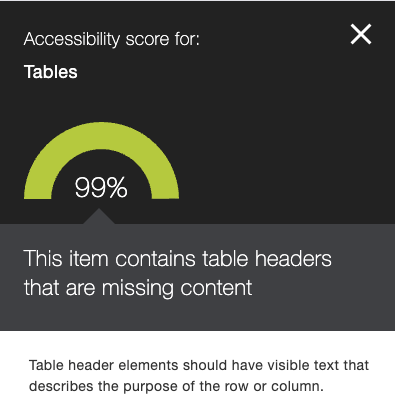
    <figcaption>Ally flags table headers that exist but contain no visible text.</figcaption>
  </figure>

::: {.callout}
**Tool gap: empty table headers.** Ally is the only tool that detects table headers with missing content. The Microsoft Accessibility Checker and Acrobat verify that a header row is designated but do not check whether the header cells actually contain text. A table with blank `<th>` cells passes both tools. A screen reader will announce "column header: blank" or silently skip the header association, leaving the student without context for the data that follows.
:::

### Broken Examples and How to Fix Them

#### Scenario 1: Missing table headers (Ally catches)

##### The broken state

A data table has no designated header row. The first row may contain labels (Date, Event, Venue) or data (Section, Quiz scores), but if those cells are `<td>` instead of `<th scope="col">`, they are not programmatically headers. Every cell is treated as data; a screen reader provides no column or row context.

##### Detected by

🔴 Ally · 🔴 MS Checker · 🔴 Acrobat

##### Example: Missing header row

| Broken | Fixed |
|--------|-------|
| Section 1 / 85 / 82; Section 2 / 83 / 81; Section 3 / 85 / 82 (all cells `<td>`) | Section / Quiz 1 / Quiz 2 (header row with `<th scope="col">`) plus data rows |

**Issue:** In the broken table, every cell is marked as `<td>`. A screen reader reads the cells as a flat stream with no column association. The student hears "85" without knowing it is a Quiz 1 score. **Fix:** Designate the first row as a header row using `<th scope="col">` for each column. The screen reader then announces the header with each cell (e.g., "Quiz 1: 85"), giving the student full context.

##### Example: Empty table headers

| Broken | Fixed |
|--------|-------|
| Header row exists but all `<th>` cells are blank. Data: Section 1/85/82, etc. | Header row contains Section / Quiz 1 / Quiz 2 with data rows below. |

**Issue:** The broken table has a designated header row, but the `<th>` cells are empty. A screen reader announces "column header: blank" or provides no association. The student hears data without context, same as having no headers at all. **Fix:** Type descriptive text into each header cell. Every `<th>` must contain visible text that describes the purpose of the row or column.

##### How to fix in Word

1. Click anywhere inside the table.
2. Go to the **Table Design** tab on the ribbon.
3. In the **Table Style Options** group, check **Header Row**.
4. Verify the first row contains descriptive text for each column.

##### How to fix in PowerPoint

1. Click anywhere inside the table.
2. Go to the **Table Design** tab on the ribbon.
3. In the **Table Style Options** group, check **Header Row**.
4. Verify the first row contains descriptive text for each column.

##### How to fix in Canvas

1. Click inside the table in the Rich Content Editor.
2. Click the **table icon** in the toolbar and select **Table properties**.
3. Under **Header**, select **Header row** (or **Header column** if the table uses row headers).
4. Click **Save**.

##### How to fix in PDF (Acrobat Pro)

1. Open the **Tags** panel (View > Show/Hide > Navigation Panes > Tags).
2. Locate the `<Table>` tag.
3. Expand the first `<TR>` (table row).
4. If the cells are tagged as `<TD>`, right-click each and select **Properties**.
5. Change the **Type** from `<TD>` to `<TH>`.
6. Set the **Scope** attribute to "Column" (or "Row" for row headers).

---

#### Scenario 2: Empty table headers (Ally catches)

##### The broken state

A table has a designated header row, but the header cells are empty. The `<th>` elements contain no visible text. This commonly occurs when a table's first row is used for spacing, when header content is conveyed through formatting (bold, color) in data cells instead, or when a layout table is incorrectly given header markup.

##### Detected by

🔴 Ally · 🟡 MS Checker · 🟡 Acrobat

##### How to fix

Open the table and type descriptive text into each header cell. Every table header element should have visible text that describes the purpose of the row or column. If the table does not need headers because it is a layout table, remove the header designation entirely (or replace the table with semantic layout).

---

#### Scenario 3: Schedule table missing row headers (Ally does not catch)

##### The broken state

A schedule or matrix table has column headers in the top row (Time, Monday, Wednesday, Friday) and a first column with time slots. The top row is correctly marked with `<th scope="col">`, but the first column uses `<td>` instead of `<th scope="row">`. Automated tools pass because a header row exists. A screen reader user navigating a data cell (e.g., "Room 201" at 9:00 AM Monday) gets the column context ("Monday") but not the row context ("9:00–10:00 AM").

##### Detected by

🟡 Ally · 🟡 MS Checker · 🟡 Acrobat (all pass; manual verification required)

##### How to fix in Word / PowerPoint

Select the first column, then in Table Design > Table Style Options, check **First Column** so the first column is designated as a header column.

##### How to fix in Canvas

In Table properties, under **Header**, select both **Header row** and **Header column** if the table has both.

##### How to fix in PDF (Acrobat Pro)

In the Tags panel, expand the first column cells. For each cell that is a row header, change the tag from `<TD>` to `<TH>` and set Scope to "Row."

::: {.callout}
**Finding.** Ally, the Microsoft Accessibility Checker, and Acrobat do not flag schedule tables that have column headers but lack row header markup. Screen reader testing is the only reliable verification for this pattern.
:::

---

#### Scenario 4: Layout table used for positioning (Ally does not catch)

##### The broken state

A table is used for visual layout (e.g., two-column page design) rather than data. The table has no real header relationship; it forces content into columns. Screen readers announce table structure (rows, columns) with no meaningful associations.

##### Detected by

🟡 Ally · 🟡 MS Checker · 🟡 Acrobat (all pass if header row is designated; tools cannot distinguish layout from data tables)

### What requires manual review

- **Layout tables.** Tables used for visual alignment rather than data presentation create confusing screen reader experiences. Automated tools do not reliably distinguish layout tables from data tables.
- **Complex tables.** Merged cells, multiple header rows, and nested tables require manual verification. For tables with both column headers (top row) and row headers (first column), use `<th scope="col">` for the top row and `<th scope="row">` for the first column. The `scope` attribute (HTML) or tagged structure (PDF) must correctly associate each data cell with its headers.
- **Appropriateness.** Some content presented in tables would be more accessible as lists or paragraphs. A "table" with one column and one row per item is really a list.

::: {.summary}
**Automated vs. Manual Summary**

- **Automated tools catch:** Tables without a designated header row, table headers with empty content (Ally only)
- **Manual review required:** Layout tables misused for formatting, complex tables with merged cells, tables that should be lists
:::

::: {.quick-check}
**Quick Check: Tables**

- Does every data table have a designated header row?
- Do all table header cells contain visible, descriptive text?
- Are tables used only for data, not for visual layout?
- Do complex tables (merged cells, multiple headers) read correctly in a screen reader?
- Would any table be clearer as a list or structured text?
:::

## Language

**[WCAG 3.1.1 Language of Page](https://www.w3.org/WAI/WCAG22/Understanding/language-of-page.html) (Level A).** The default human language of each page or document must be programmatically determinable.
**[WCAG 3.1.2 Language of Parts](https://www.w3.org/WAI/WCAG22/Understanding/language-of-parts.html) (Level AA).** The language of each passage or phrase that differs from the document's default language must be programmatically determinable.

Language affects how screen readers pronounce content. When a document's language metadata is missing or incorrect, a screen reader applies the wrong pronunciation rules. English phonetics applied to a Spanish passage, for example, renders the text incomprehensible.

<!-- Scenario: Missing language of parts | Error ID: E12 -->

**Missing language of parts (E12)**

| Broken | Corrected |
|--------|-----------|
| Julio se despertó con mucho frío. Agarró su abrigo rojo y salió a la calle. El cielo estaba gris y hacía un viento horrible. Qué barbaridad, gritó, mientras caminaba hacia la panadería. Quería comprar churros y un chocolate caliente. La señora de la tienda le dijo: Hijo, hoy no hay churros, pero tengo unas galletas riquísimas. Julio se rió y contestó: Bueno, déjeme cinco galletas y un jugo de naranja. Pagó con unas monedas que llevaba en el bolsillo y se fue silbando bajito por la acera. | Julio se despertó con mucho frío. Agarró su abrigo rojo y salió a la calle. El cielo estaba gris y hacía un viento horrible. Qué barbaridad, gritó, mientras caminaba hacia la panadería. Quería comprar churros y un chocolate caliente. La señora de la tienda le dijo: Hijo, hoy no hay churros, pero tengo unas galletas riquísimas. Julio se rió y contestó: Bueno, déjeme cinco galletas y un jugo de naranja. Pagó con unas monedas que llevaba en el bolsillo y se fue silbando bajito por la acera. |
| **What happens:** Screen reader uses wrong pronunciation; Spanish is read with English phonetics ("JOO-lee-oh say des-per-TOE con MOO-cho FREE-oh") and is incomprehensible. | **What happens:** Screen reader switches to Spanish pronunciation and reads the passage naturally. |

### Automated tool reliability by file type

| File type | Ally | MS Office | Acrobat |
|-----------|------|-----------|---------|
| Word (.docx) | Unreliable | Not checked | N/A |
| PowerPoint (.pptx) | Unreliable | Not checked | N/A |
| PDF | Unreliable | N/A | Checks missing language only |
| Canvas (HTML) | Checked | N/A | N/A |

Canvas is the only file type where language detection works reliably, because Ally uses axe-core to check the `lang` attribute on the HTML element.

For Word and PowerPoint, Ally's language detection is inconsistent. The Microsoft Accessibility Checker does not flag language issues at all. For PDF, Acrobat can detect a missing language attribute but cannot detect an incorrect one.

### What no automated tool detects

- **Incorrect document language** (e.g., a document tagged as French when the content is English). Ally may flag this in some cases but not reliably across file types.
- **Language of parts.** No automated tool detects that a Spanish paragraph within an English document needs its own language attribute. This can only be verified by listening with a screen reader.

### Setting language of parts

- **Word:** Select the text, then set the proofing language (Review > Language > Set Proofing Language). This embeds the language at the character level.
- **Canvas:** In the HTML editor, wrap the passage in a `span` or `div` with a `lang` attribute (e.g., `...`).
- **PDF:** Use the tags panel in Acrobat Pro to set the language attribute on individual content tags.

::: {.callout}
**Key point.** Language is the least reliably detected issue across automated tools. For Word and PowerPoint, Ally's checks are inconsistent. The Microsoft Accessibility Checker does not check language at all. Only Canvas HTML is reliably checked.
:::

::: {.summary}
**Automated vs. Manual Summary**

- **Automated tools catch:** Missing language attribute (Canvas HTML only is reliable; Word, PowerPoint, and PDF are unreliable)
- **Manual review required:** Incorrect document language, language of parts, pronunciation accuracy
:::

::: {.quick-check}
**Quick Check: Language**

- Is the document language set correctly in the file properties?
- Do passages in other languages have their own language attributes?
- Has a screen reader been used to verify pronunciation of foreign-language content?
- In Word, is the proofing language set on foreign-language selections?
:::

## Seizure Risk

**[WCAG 2.3.1 Three Flashes or Below Threshold](https://www.w3.org/WAI/WCAG22/Understanding/three-flashes-or-below-threshold.html) (Level A).** Content must not contain anything that flashes more than three times per second, *unless* the flashing falls below both the general flash and red flash thresholds (i.e., the flashing area is small enough and the luminance change is low enough to be considered safe). In practice, for course content the simplest guidance is to avoid flashing entirely; the threshold exceptions are relevant mainly to multimedia producers performing formal photosensitive analysis.

Seizure risk is the least common issue in course content (likelihood 1/5) but carries the highest possible impact (5/5). A single flashing element can trigger a photosensitive seizure.

### What automated tools detect

Ally checks for rapid flashing in **image files only** (primarily animated GIFs). This is the only file type where seizure risk is evaluated.

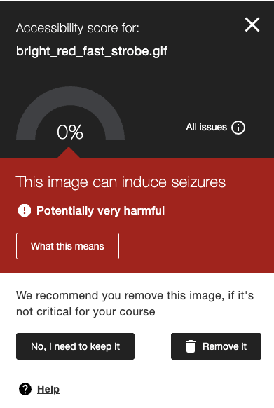

*Ally flags a flashing GIF with a 0% score and recommends removal.*

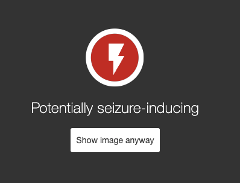

*Warning shown before displaying seizure-inducing content, with option to bypass.*

::: {.callout}
**Note.** This document cannot show actual flashing content because it could cause direct harm (photosensitive seizure) to readers. The illustration below represents the concept of flashing content; in real course materials, a rapidly flashing GIF or animation would appear in the "Broken" column.
:::

<!-- Scenario: Flashing GIF (seizure risk) | Error ID: E13 -->

**Flashing content (E13)**

| Broken | Corrected |
|--------|-----------|
|  |  |
| **What happens:** Content flashes; seizure risk for photosensitive users. | **What happens:** No flashing; same information conveyed without seizure risk. |

### What is not checked

| File type | Status |
|-----------|--------|
| Word (.docx) | Gap: not checked |
| PowerPoint (.pptx) | Gap: not checked |
| PDF | Gap: not checked |
| Canvas pages | Gap: not checked |
| Image (GIF) | Checked |

The most common sources of flashing content in courses (**embedded video, PowerPoint transitions and animations, and auto-playing media**) are not evaluated by any of the standard automated tools.

### Guidance

- Avoid strobe effects, rapid transitions, and flashing animations in all content.
- Review embedded videos for flashing sequences, especially screen recordings with rapid UI changes.
- Use subtle, purposeful animations in PowerPoint rather than attention-grabbing transitions.
- When in doubt, the Photosensitive Epilepsy Analysis Tool (PEAT) can evaluate video content against the flash threshold.[^3]

::: {.callout}
**Key point.** Seizure risk has the lowest likelihood but the highest possible impact. Ally only checks image files (GIFs). Video, PowerPoint animations, and auto-playing media are not evaluated by any automated tool.
:::

::: {.summary}
**Automated vs. Manual Summary**

- **Automated tools catch:** Rapid flashing in animated GIFs (image files only)
- **Manual review required:** Embedded video, PowerPoint transitions and animations, auto-playing media, CSS animations
:::

::: {.quick-check}
**Quick Check: Seizure Risk**

- Does any content flash more than three times per second?
- Have embedded videos been reviewed for strobe or rapid flashing sequences?
- Are PowerPoint transitions subtle and purposeful, not rapid or strobing?
- Has auto-playing media been avoided or reviewed?
:::

---

[^1]: Deque Systems. "What We Found When We Tested Tools on the World's Most Accessible Websites," 2021. https://www.deque.com/blog/automated-testing-study-identifies-57-percent-of-digital-accessibility-issues/ - The 57% figure reflects the upper bound from Deque's axe-core engine analysis. Other research places automated detection lower; see, e.g., the UK Government Digital Service's 2017 audit (~30%) and Power Mapper's WCAG coverage studies (25-40%).

[^2]: National Center for Education Statistics. "Students With Disabilities." Condition of Education, U.S. Department of Education, 2023. https://nces.ed.gov/programs/coe/indicator/cgg

[^3]: Trace Research & Development Center. "Photosensitive Epilepsy Analysis Tool (PEAT)." University of Maryland. https://trace.umd.edu/peat/

<!-- Presenter notes (hidden): Workshop demonstration sequence -->
<!-- 1. E1, E2, E3, E10 (Run Microsoft Accessibility Checker) -->
<!-- 2. Export PDF & run Acrobat fixes (E6 artifact tagging, reading order) -->
<!-- 3. Upload to Canvas & review Ally (E7 false positive, E9 verification) -->
<!-- 4. Manual review & screen reader checks (E4, E5, E8, E11, E12, E13) -->
